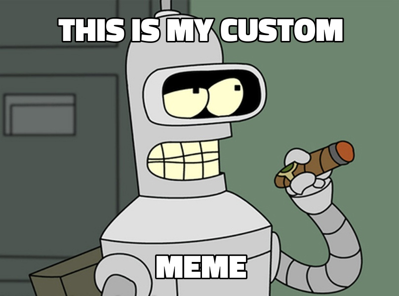

# Meme scraper

this application allow you to download the first 10 memes alocated on https://memegen.link/examples, you can get this images on diferent versions accordingly to the commands that you use as imput

## Usage

- to get the meme images whitout modification write on the command line

`sh node index.js `

- to get the meme images clean without any text run the app like this

`sh node index.js clean `

- to get the meme with a custom text just add one or two inputs on the command. comands whit more that one word can be separated whit a "\_".

`sh node index.js this_is_my_custom meme`

